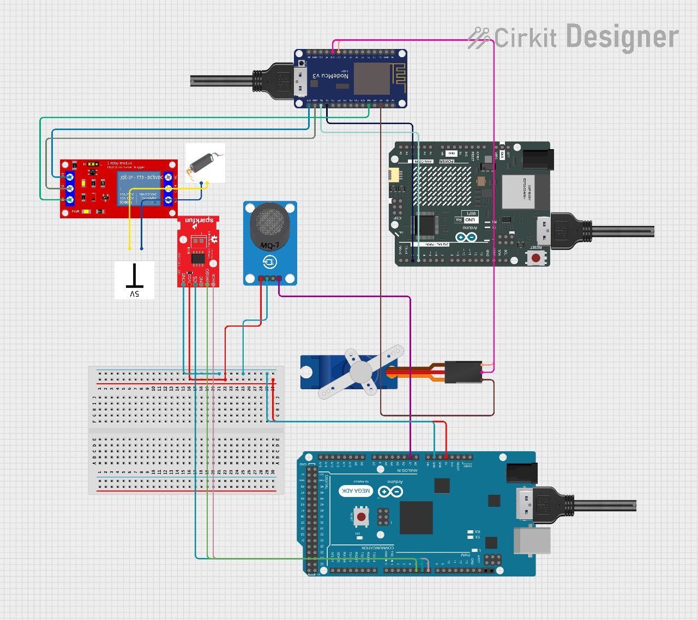

# SCAL LAB: PCB Design – Automated Cooking Stove 

This repository contains PCB designs initially intended for an automated cooking stove project and the IoT hardware schematic for the proposed gas stove. Although the final implementation using a PCB was dropped, the repository includes schematic and board layouts for circuits designed during the exploration and learning phase.
Also, it contains the hardware   integrated schematic to act as a proof of concept for the proposed stove.

## 🔧 Tool Used

- [Autodesk EAGLE EDA](https://www.autodesk.com/products/eagle/overview)

## 🤝 Collaborators

Worked with **Naman Jain** and **Chiranjit Saha** to conceptualize and partially prototype an IoT-enabled automated gas stove. The system architecture included:

- 🔥 Spark Plug  (to ignite the gas)
- 🌡️ Temperature Sensor (to monitor the flame temperature)
- 🔁 Servo Motor (to rotate the stove knob)

These components were to be integrated for automatic gas ignition and control based on environmental conditions.

## 🧩 Practice Circuit Schematic

One of the practice schematic designs is shown below:

 <!-- Make sure this path matches your repo file structure -->

## 🛠️ Skills Practiced

- PCB Schematic & Layout Design
- EAGLE Board Design Workflow
- IoT Hardware Integration
- Collaborative Design Planning

## 📌 Disclaimer

These PCB designs were created for educational and practice purposes only and are not part of a finalized or fabricated product.

